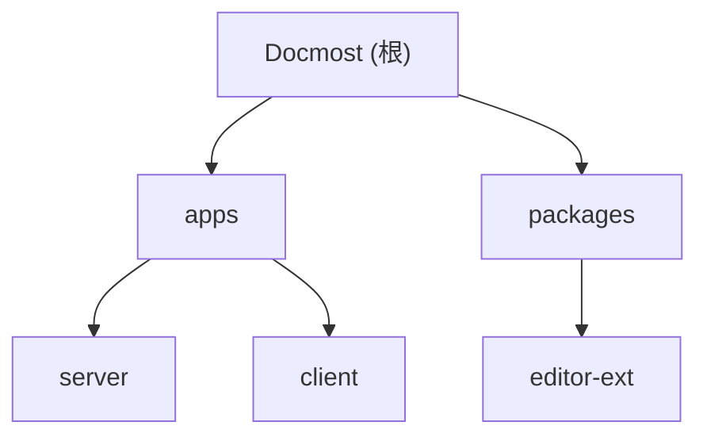

# Docmost

## 项目愿景

Docmost 是一个开源的协作知识库和 Wiki 平台，旨在为团队提供实时协作编辑、知识管理和信息共享能力。它支持多工作区、空间、页面层级结构、细粒度权限控制、全文搜索、AI 功能等，适合作为企业内部文档中心使用。

## 架构总览

Docmost 采用 **monorepo** 架构，基于 pnpm workspaces + Nx 管理，包含三个核心模块：

- **apps/server** -- NestJS 后端服务，提供 REST API、WebSocket 实时通信、协作编辑服务器
- **apps/client** -- React + Vite 前端单页应用，使用 Mantine UI 组件库
- **packages/editor-ext** -- TipTap/ProseMirror 编辑器扩展包，被 server 和 client 共用

技术栈：
- 语言：TypeScript（全栈）
- 后端框架：NestJS + Fastify
- 前端框架：React 18 + Vite 8
- 编辑器：TipTap 3（基于 ProseMirror）+ Yjs 实时协作
- 数据库：PostgreSQL（通过 Kysely ORM）
- 缓存/队列：Redis + BullMQ
- 实时协作：Hocuspocus + Yjs
- 对象存储：本地或 AWS S3
- 邮件：SMTP 或 Postmark
- 搜索：PostgreSQL 全文检索 或 Typesense（企业版）；spotlight 内置搜索词联想（基于 `search_keywords` 表）
- AI：OpenAI / Gemini / Ollama（企业版）
- 部署：Docker

## 模块结构图



## 模块索引

| 模块路径 | 语言 | 职责 | 入口文件 | 测试 |
|---|---|---|---|---|
| `apps/server` | TypeScript | NestJS 后端：REST API、WebSocket、协作服务器、后台任务 | `src/main.ts` | 19 个 `.spec.ts` 文件 |
| `apps/client` | TypeScript/TSX | React 前端 SPA：页面编辑、设置、搜索、空间管理 | `src/main.tsx` | 无单元测试 |
| `packages/editor-ext` | TypeScript | TipTap 编辑器扩展：表格、数学、Draw.io、Excalidraw 等 | `src/index.ts` | 无测试 |

## 运行与开发

### 环境要求

- Node.js 22+
- pnpm 10.4.0
- PostgreSQL 18+
- Redis 8+

### 关键配置

复制 `.env.example` 为 `.env` 并填写：

- `APP_URL` -- 应用域名
- `APP_SECRET` -- 至少 32 字符的密钥
- `DATABASE_URL` -- PostgreSQL 连接串
- `REDIS_URL` -- Redis 连接串
- `STORAGE_DRIVER` -- `local` 或 `s3`
- `MAIL_DRIVER` -- `smtp` 或 `postmark`
- `SEARCH_DRIVER` -- `database`（默认，PostgreSQL 全文检索）或 `typesense`（企业版，需配 `TYPESENSE_URL` / `TYPESENSE_API_KEY` / `TYPESENSE_LOCALE`）

### 常用命令

```bash
# 安装依赖
pnpm install

# 开发模式（前后端同时启动）
pnpm run dev

# 仅启动前端开发服务器
pnpm run client:dev

# 仅启动后端开发服务器
pnpm run server:dev

# 构建所有模块
pnpm run build

# 生产模式启动后端
pnpm run start

# 启动协作服务器（独立进程）
pnpm run collab

# 数据库迁移
pnpm --filter server run migration:latest
pnpm --filter server run migration:create   # 创建新迁移
pnpm --filter server run migration:up       # 执行迁移
pnpm --filter server run migration:down     # 回滚迁移

# 邮件开发预览
pnpm run email:dev

# 灌入搜索验证测试数据（生成 "AI 从 0 到 1" 主题文档，便于验证 spotlight 联想词/高亮）
node scripts/seed-ai-docs.mjs --email <email> --password <password> [--base http://localhost:3000] [--limit 50]
```

### Docker 部署

```bash
docker compose up -d
```

Docker Compose 包含三个服务：`docmost`（应用）、`db`（PostgreSQL）、`redis`。应用端口 3000。

### Dev Container（可选）

仓库根目录提供 `.devcontainer/`（`Dockerfile` + `devcontainer.json` + `docker-compose.yml`），用于 VSCode Remote-Containers 一键开发环境：
- `postCreateCommand` 自动修正具名卷权限并执行 `pnpm install` + `migration:latest`
- 转发端口：3000（后端 API）、5173（Vite）、3001（协作）
- 预装 ESLint / Prettier / Tailwind / Docker / YAML 扩展

## 测试策略

- **后端**：使用 Jest 进行单元测试，测试文件以 `.spec.ts` 后缀与源文件同目录放置
  - 现有测试覆盖：auth、comment、group、page、search、space、workspace、storage、environment
  - 注意：`core/search` 的 `.spec.ts` 目前仅为 "should be defined" 桩，未覆盖 `searchSuggestions` / `logSearchKeyword` / `getKeywordSuggestions` 等新方法（见各模块缺口）
  - 运行：`pnpm --filter server run test`
  - 覆盖率：`pnpm --filter server run test:cov`
  - E2E 测试：`pnpm --filter server run test:e2e`
- **前端**：目前无单元测试
- **编辑器扩展**：目前无测试

## 编码规范

- TypeScript 严格模式
- 后端 ESLint + Prettier：`pnpm --filter server run lint` / `pnpm --filter server run format`
- 前端 ESLint：`pnpm --filter client run lint`
- 后端使用 class-validator + class-transformer 进行 DTO 验证
- 后端 API 前缀为 `/api`，全局使用 `ValidationPipe`（whitelist + stopAtFirstError）
- 前端使用 Jotai（状态管理）、TanStack Query（数据获取）、Zod（表单验证）
- 编辑器扩展包为纯 TypeScript，无框架依赖

## AI 使用指引

- 修改后端业务逻辑时，注意模块边界：`core/` 下是核心业务模块，`integrations/` 下是基础设施集成，`community/` 下是社区版功能
- 企业版代码在 `apps/server/src/ee/` 和 `apps/client/src/ee/`，通过动态 `require` 加载（社区版不含此目录）。例如搜索的 Typesense 驱动位于 `ee/typesense/`，由 `SearchController.searchTypesense` 动态加载
- 数据库类型定义由 `kysely-codegen` 自动生成（`apps/server/src/database/types/db.d.ts`），不要手动编辑
- 数据库迁移文件在 `apps/server/src/database/migrations/`，按时间戳命名（当前共 44 个）
- 编辑器扩展同时被 server（服务端渲染 HTML）和 client（客户端编辑）使用，修改时需考虑两端兼容
- 权限系统基于 CASL：`core/casl/` 定义了 workspace 和 space 级别的 ability factory
- 实时协作基于 Hocuspocus + Yjs，可独立部署（`COLLAB_PORT` 环境变量，默认 3001）
- 搜索建议功能跨前后端：后端 `core/search`（`/search/suggest`、`/search/log`、`/search/keywords`）+ 新表 `search_keywords`；前端 `features/search`（含 `keyword-suggestions.tsx`）。修改任一端时请同步更新另一端契约（`dto/search.dto.ts` ↔ `types/search.types.ts`）

## 变更记录 (Changelog)

| 日期 | 操作 | 说明 |
|---|---|---|
| 2026-06-26 | 更新 | 增量更新：补充 spotlight 搜索词联想功能链路（`search_keywords` 表 + `/search/log` + `/search/keywords` + 前端 `keyword-suggestions.tsx`）；修正迁移数为 44；新增 `.devcontainer/`、`scripts/seed-ai-docs.mjs`、`SEARCH_DRIVER` 配置说明；记录 search 单测覆盖缺口 |
| 2026-06-15 | 新建 | 初始化架构文档，完成全仓扫描 |
